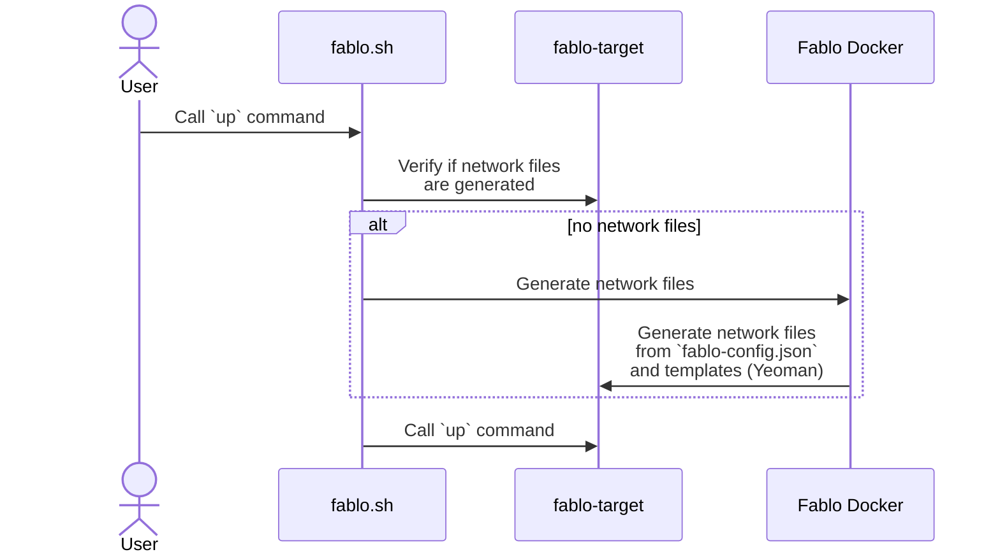

# Fablo architecture

Fablo is a tool that allows to setup a running Hyperledger Fabric network on the basis of a config file.

The main flow of the application is presented in the diagram below (for instance for the `up` command):

There are three important layers in this flow:

1. `fablo.sh` - this is our CLI. It accepts user commands, does some validation, and forwards them either to Fablo Docker container or generated network scripts in `fablo-target` directory.
2. Fablo Docker - is a Docker image that contains templates for generating the network files and Yeoman. When Fablo Docker is running, it has mounted `fablo-config.json` file from host and `fablo-target` directory.
3. `fablo-target` is a directory which contains generated Hyperledger Fabric network files (config files, helper scripts, temporary network files).

Notable files and directories:

* `./src` - source code for Yeoman generators, containing subdirectories for given commands and EJS template files.
* `./fablo.sh` - Fablo CLI script.
* `./Dockerfile`, `./docker-entrypoint.sh`, `fablo-build.sh` - files that define and are used to build the Fablo Docker image.
* `e2e-network` - directory that contains integration tests written in Bash scripts. Their goal is to setup sample networks with Fablo and verify them.
* `e2e` - directory that contains integration tests for generating network target files. Tey are mostly Jest snapshot tests.
* `samples` - directory with sample Fablo config JSON and YAML files.

See also [Contributing Guidelines](CONTRIBUTING.md), where you can find some more instructions how to run Fablo from source code and useful hints what needs to be done while working with the code.
