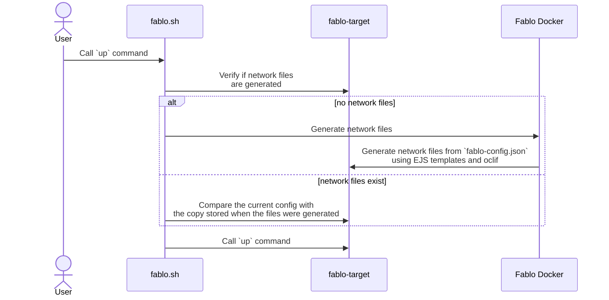

# Fablo architecture

Fablo is a tool that allows to setup a running Hyperledger Fabric network on the basis of a config file.

The main flow of the application is presented in the diagram below (for instance for the `up` command):

```mermaid
sequenceDiagram
  actor User
    User ->> fablo.sh: Call `up` command
    fablo.sh ->> fablo-target: Verify if network files<br/>are generated
    alt no network files
      fablo.sh ->> Fablo Docker: Generate network files
      Fablo Docker ->> fablo-target: Generate network files from `fablo-config.json`<br>using EJS templates and oclif
    else network files exist
      fablo.sh ->> fablo-target: Compare the current config with<br/>the copy stored when the files were generated
    end
    fablo.sh ->> fablo-target: Call `up` command

```

There are three important layers in this flow:

1. `fablo.sh` - this is our CLI. It accepts user commands, does some validation, and forwards them either to Fablo Docker container or generated network scripts in `fablo-target` directory. It also runs the generated hooks. It calls `fablo-target/hooks/post-generate.sh` after generating the network files, and `fablo-target/hooks/post-start.sh` after the `up` and `start` commands.
2. Fablo Docker - is a Docker image that contains the oclif CLI framework and EJS templates used to generate the network files. When `fablo.sh` runs the container, it mounts a workspace directory from the host at `/network/workspace`. For the commands that read a config file, it also mounts that file at `/network/workspace/fablo-config.json`, whether the source file is JSON or YAML. The workspace is the `fablo-target` directory for the `generate` command, and for most of the other commands it is a temporary directory that `fablo.sh` removes when it exits.
3. `fablo-target` is a directory which contains generated Hyperledger Fabric network files (config files, helper scripts, temporary network files). The main generated script is `fabric-docker.sh`. Fablo generates `fabric-k8s.sh` instead when `global.engine` is `kubernetes`, and `fabric-x-docker.sh` when `global.provider` is `fabric-x`, and `fablo.sh` runs whichever of the three scripts it finds there. Fablo also stores a copy of the config file it used during generation in this directory, and the `up` command compares that copy with the current config file and stops with an error when they differ.

Notable files and directories:

* `./src` - source code for oclif commands and the EJS templates they use. The commands are in `./src/commands`, and the code and templates that write the network files are in `./src/setup-docker` and `./src/setup-k8s`.
* `./fablo.sh` - Fablo CLI script.
* `./Dockerfile`, `./docker-entrypoint.sh`, `fablo-build.sh` - files that define and are used to build the Fablo Docker image.
* `e2e-network` - directory that contains integration tests written in Bash scripts. Their goal is to setup sample networks with Fablo and verify them.
* `e2e` - directory that contains integration tests for generating network target files. They are mostly Jest snapshot tests.
* `samples` - directory with sample Fablo config JSON and YAML files.

See also [Contributing Guidelines](CONTRIBUTING.md), where you can find some more instructions how to run Fablo from source code and useful hints what needs to be done while working with the code.
